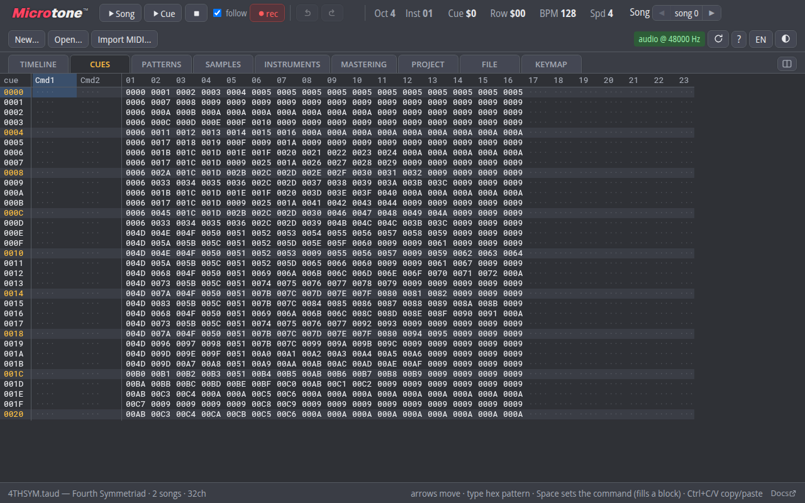
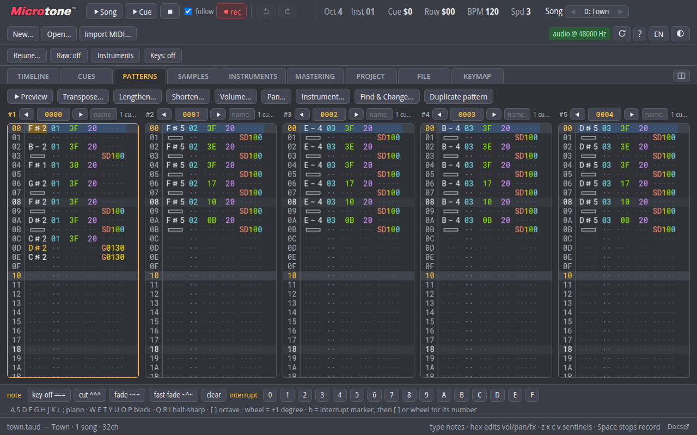
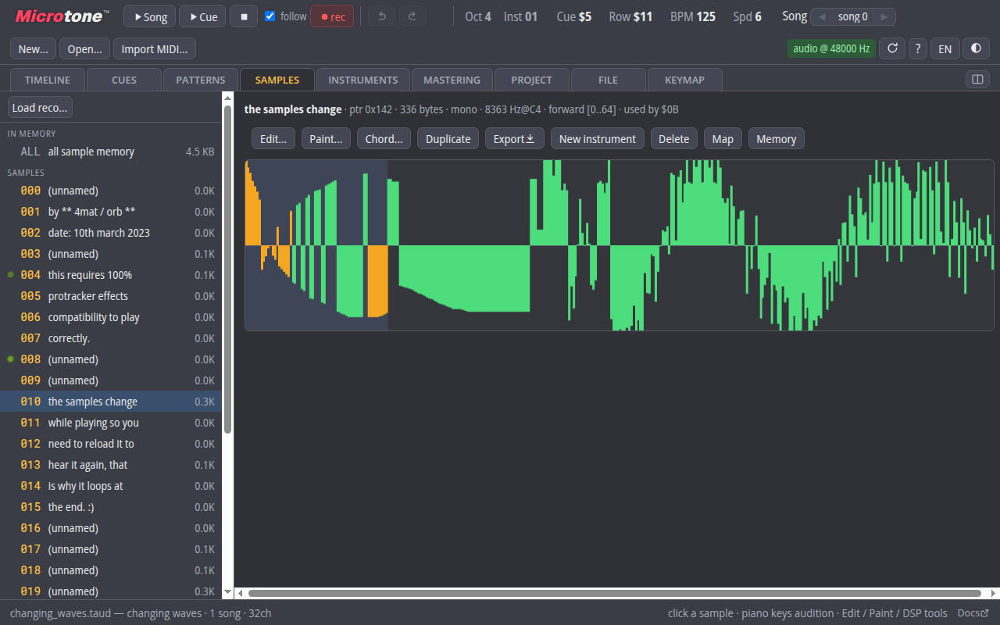
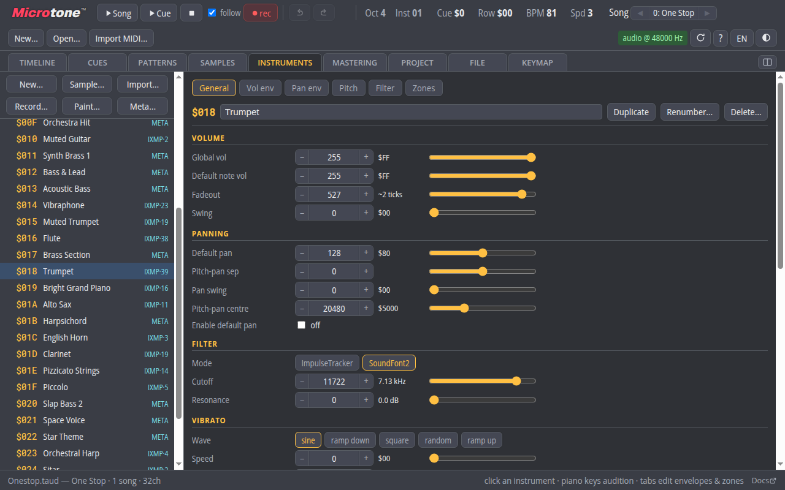
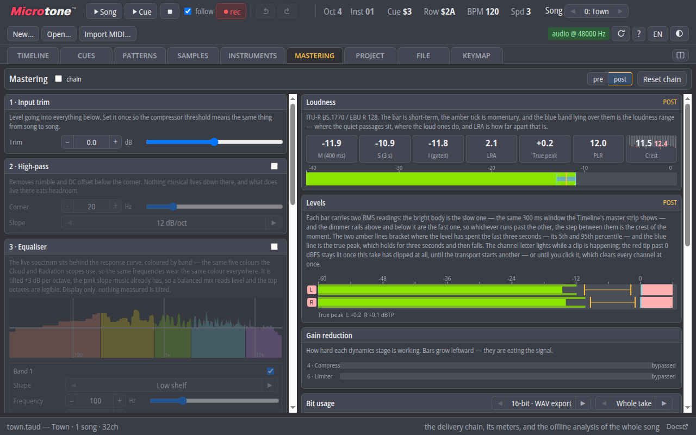
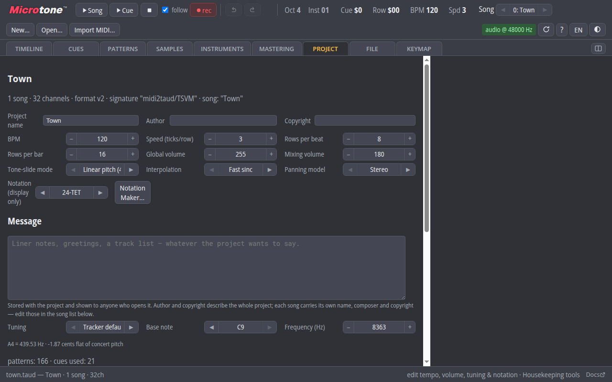
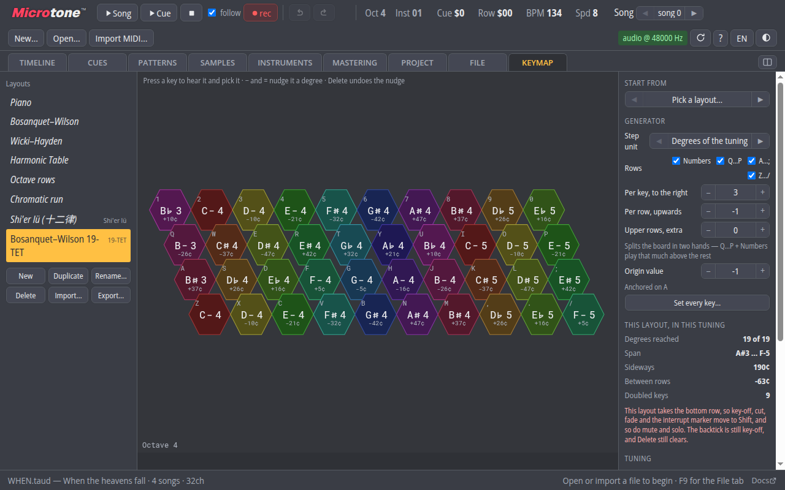

# Microtone.js


**Microtone** is a music tracker for the notes a piano cannot play. Every pitch
sits on a grid of 4096 steps per octave, so 12-TET, 19-TET, 31-TET,
Bohlen–Pierce and a temperament you drew yourself are all the same kind of thing
to it. Sources can be placed anywhere on the sphere and delivered as ambisonic
B-format as readily as stereo. It runs in a browser tab, and that is the entire
install.

## Try it

Simply visit **[microtone.cc](https://microtone.cc)** and start tracking; no
strings attached. There is no account and no server side — projects live in your
browser's private storage, and even MIDI and module conversion happens on your
own machine. Three demo songs sit on the welcome screen if you would rather hear
it before writing anything, the **?** button opens the keyboard reference, and
the [full manual](https://microtone.cc/docs.html) is inside the app.

### What it does

- **Any tuning, not just the twelve.** Pick a notation preset — 12, 19, 24, 31,
  41-TET (with Kite glyphs), Shi'er lü, Bohlen–Pierce — or draw your own in the
  Notation Maker, and the editor snaps entry, display and stepping to its
  degrees. Retune a whole song between tunings without rewriting it.
- **Opens what you already have.** `.taud` is the native project; `.mod`,
  `.s3m`, `.xm`, `.it`, `.mon` and AdLib `.ims` are converted on the fly, and
  **Import MIDI…** renders a `.mid` through a SoundFont. A General MIDI bank and
  an AdLib bank ship with the app, so an import sounds without you hunting for
  one first.
- **Space, not merely width.** A song chooses stereo, planar 360° or the full
  sphere, and the pan column carries a real angle. Export stereo, quadraphonic,
  5.1, 7.1 or ambisonic B-format (first to third order, AmbiX with ADM
  metadata) — or stems, one mono WAV per track in a single ZIP.
- **Master it in the same window.** Trim, high-pass, EQ, compressor and limiter,
  with loudness, true-peak, crest and gain-reduction metering, and an offline
  analysis of the whole song. The chain you hear is the chain the export
  renders through.
- **Instruments that are more than samples.** Envelopes, filters, panning and
  note-stealing rules per instrument, plus metainstruments — a *Layered* kit
  that sounds several instruments side by side, or an *FM Rack* that wires them
  into one another.
- **Your keyboard becomes the instrument.** Forty keys laid out as an isomorphic
  lattice — Bosanquet–Wilson, Wicki–Hayden, Harmonic Table and more — fitted to
  whatever tuning the song is in.

## A look around



**Cues** are the song's order list. A Taud pattern belongs to a single channel,
so every voice gets its own column and its own pattern number on every row: the
bassline can hold for sixteen cues while the lead changes on each one. The two
command columns on the left carry the flow — jump, halt, cue length — and a
whole run of them can be filled in one step.



The **pattern editor** puts several patterns side by side, which is how you write
against something that already exists: keep the part you are answering in view,
copy a phrase out of one column and into the next, or edit two voices of the
same passage without losing your place in either.



The **sample bin**, mid-song. The orange in this waveform is Invert Loop
(`S $F0xx`) at work — the effect walks through the loop region flipping one
byte at a time, and every byte it has touched so far is tinted live as the song
plays. Nothing is written to the file: stop the transport and the sample is
exactly as it was.



The **instrument editor** is the main work panel. Each instrument is a sample
plus its volume, panning, filter, vibrato and note-stealing behaviour; the
tabs above carry its envelopes and its zone map. The badges in the list say
where an instrument came from — `META` for a metainstrument, `IXMP` for a
SoundFont patch and the number of pitch × velocity zones it brought with it.



The **mastering tab**, metering a song as it plays. Microtone lets you write and
master the piece in one application: the rack down the left is the delivery
chain, the meters on the right are the ones a mastering engineer asks for —
short-term and integrated loudness, loudness range, true peak, crest against its
allpassed twin — and the same chain is what an export renders through.



The **project tab** holds everything about the piece that is not a note: tempo
and meter, global and mixing volume, the tuning reference and its frequency, the
panning model, the display notation, and the message that travels inside the
file. Housekeeping tools for the whole project live at the bottom of it.



The **keymap tab** turns a computer keyboard into a 40-key isomorphic
microtonal instrument. This is Bosanquet–Wilson fitted to 19-TET: all nineteen
degrees fall under the fingers, each cap says what it plays in the song's own
notation and how far that is from 12-TET, and the colour bands repeating across
the board *are* the isomorphism. Layouts are yours rather than the song's — they
travel as `.taudkey` files — but a piece that needs a particular one can carry a
copy of it.

## Just the player — `taudplay`

**If you are here for the playback module rather than the tracker, simply run
`npm i taudplay`.** No tracker attached.

`taudplay` is the playback half of this engine as a standalone LGPL-3.0 library,
for pages and games that want to *play* a `.taud` rather than edit one. A file
rendered there is bit-identical to the same file rendered in the tracker. Its
whole surface is a transport, **one fader per voice**, **two probes per voice**
(how loud that channel is right now, and where it sits) and the sixteen
**interrupts** the song itself fires in time with the music:

```js
import { TaudPlayer } from "taudplay";

const player = await new TaudPlayer().init();
await player.load(await (await fetch("theme.taud")).arrayBuffer());
button.onclick = async () => { await player.resume(); player.play(); };

player.setVoiceGain(LEAD, 0.0, 1200);        // duck the lead over 1.2 s
player.setInterrupt(0, (n) => spawnEnemy(n)); // let the song cue the game
```

That is the point of it. A game does not want a pattern editor; it wants to duck
the lead when the player enters a cave and bring the drums up in combat. A
tracker song is 32 or 64 channels that were *written together*, so fading them
against each other gives you contextual scoring for the cost of one file.

`player.html` in this repository is its reference consumer.

---

# For developers

Two halves live here:

- **Taud engine** (`src/engine/`) — a faithful JavaScript translation of the
  tracker engine in TSVM's `AudioAdapter.kt`, running inside an AudioWorklet.
  Pure computation, no DOM/Web Audio imports, so the same code runs headlessly
  under Node for conformance testing against the JVM engine.
- **Microtone tracker** (`src/ui/`) — a native web rewrite of the tracker UI
  (the TSVM `taut.js` is the behavioural reference).

## Running locally

No build step. Serve the directory with any static file server:

```sh
npm run serve            # python3 -m http.server 8737
# then open http://localhost:8737/            (tracker)
#           http://localhost:8737/player.html (minimal player)
```

## Testing

Requires Node ≥ 22.

```sh
node --test        # discovers test/node/*.test.js and test/taudplay/*.test.js
```

Browser smoke pages under `test/browser/` are driven headlessly over CDP:

```sh
node tools/browser-smoke.js test/browser/taudplay-smoke.html
```

Engine conformance is verified against PCM dumps rendered by the real JVM
engine (`tsvm/devtests/webconf/`) over the corpus in `test/corpus/`:

```sh
node tools/render-taud.js test/corpus/WHEN.taud out.pcm
node tools/compare-pcm.js out.pcm reference.pcm
```

## Regenerating taudplay

`src/taudplay/` is authored here; the standalone LGPL-3.0 repository is a
generated artefact carrying a verbatim copy of the engine. Rebuild it — and the
committed single-file worklet the non-module-worklet fallback loads — with:

```sh
node tools/make-taudplay.js [outDir]   # default ../../../microtone-taudplay (a sibling checkout)
```

The engine there is a copy of this one, so **re-run it after any engine
change** — otherwise the library and the tracker stop agreeing about what a
song sounds like. Its own suite (`test/taudplay/`) travels with it and asserts
exactly that.

## Layout

| Path | Contents |
|---|---|
| `src/engine/` | Taud engine port (worklet- and Node-safe, no imports outside itself) |
| `src/format/` | .taud/.tsii/.tpif parser + serialiser (gzip/zstd via `vendor/`) |
| `src/worklet/` | AudioWorkletProcessor + message protocol |
| `src/taudplay/` | the standalone player library (see above) |
| `src/audio/` | main-thread audio system (context lifecycle, snapshots) |
| `src/doc/` | canonical document model, invertible ops, undo, worklet sync |
| `src/ui/` | tracker application (vanilla ES modules, canvas + DOM) |
| `src/storage/` | OPFS virtual disk, import/export |
| `vendor/` | vendored single-file ESM deps (see `vendor/VENDOR-VERSIONS.md`) |
| `test/corpus/` | .taud conformance/demo corpus (from the TSVM repo) |
| `test/fixtures/` | file formats built rather than committed (the .ims/.bnk pair) |
| `tools/` | Node CLIs: render, compare, inspect, worklet-bundle, taudplay, browser tests |

## Provenance

Engine port keeps the Kotlin function/field names (`applyTrackerRow`,
`triggerNote`, `resolveActiveEnvelopes`, …) so future syncs against
`tsvm/tsvm_core/src/net/torvald/tsvm/peripheral/AudioAdapter.kt` diff cleanly.
Format reference: `tsvm/terranmon.txt` §"Taud serialisation format";
effect semantics: `tsvm/TAUD_NOTE_EFFECTS.md`.

Two banks ship with the app so an import can sound without the user hunting for
one: `assets/GeneralUser-GS.taud.sf2.gz` (GeneralUser GS, for MIDI) and
`assets/STANDARD.BNK.gz` (the general AdLib instrument bank the Iyagi Music
Sound corpus resolves its patch names against, for `.ims`). Neither is used
unless an import asks for it.

## Copyright

Copyright (C) 2026 CuriousTorvald

This program is free software: you can redistribute it and/or modify
it under the terms of the GNU General Public License as published by
the Free Software Foundation, either version 3 of the License, or
(at your option) any later version.

This program is distributed in the hope that it will be useful,
but WITHOUT ANY WARRANTY; without even the implied warranty of
MERCHANTABILITY or FITNESS FOR A PARTICULAR PURPOSE.  See the
GNU General Public License for more details.

You should have received a copy of the GNU General Public License
along with this program.  If not, see <http://www.gnu.org/licenses/>.
